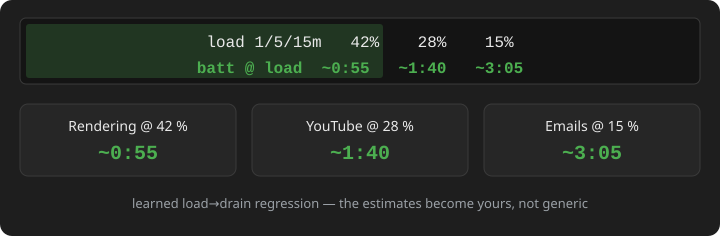

# BATTERY_ESTIMATION.md – how the reference tools compute remaining time

Research status: 2026-10-03 · basis for v0.3.0 implementation
Sources: `docs/RESEARCH.md` (#1 BatteryBar wiki, #3/#4 local research),
live API probes on the dev machine (Windows 11, ~53.7 Wh battery).

---

## 1. What Windows itself provides

| API / source | Data | Verdict |
|---|---|---|
| `GetSystemPowerStatus` → `BatteryLifeTime` | seconds remaining, `0xFFFFFFFF` when unknown | Unreliable: often "unknown" right after unplugging – Windows needs a while to build its own estimate. Still useful as last-resort fallback. |
| `CallNtPowerInformation(SystemBatteryState=5)` → `SYSTEM_BATTERY_STATE` | `AcOnLine`, `BatteryPresent`, `Charging`, `Discharging`, `MaxCapacity` (mWh), `RemainingCapacity` (mWh), `RateOfDrain` (signed mW, <0 while discharging), `EstimatedTime` (s, `0xFFFFFFFF` unknown) | **Best source — with a caveat.** Real mWh capacities + live drain rate straight from the battery fuel gauge. Verified on the dev machine: `MaxCapacity 53673 mWh`, `RemainingCapacity 53673 mWh`. One ctypes call, stdlib only. **Caveat (found in v0.3.1 debugging):** `RateOfDrain` may be `0x80000000` = `BATTERY_UNKNOWN_RATE` — this battery reports **no rate at all**. Consumers must treat the sentinel as "not reported", not as a huge negative drain (that bug produced "0:00 h"). |
| WMI `Win32_Battery` | `EstimatedRunTime` (min), `EstimatedChargeRemaining`, `DesignCapacity`, `FullChargeCapacity` | **Useless in practice.** Probe returned `EstimatedRunTime = 71582788` (sentinel garbage) and empty capacity fields. Do not use. |
| `IOCTL_BATTERY_QUERY_INFORMATION` | `BATTERY_INFORMATION` incl. `FullChargedCapacity`, `DesignedCapacity`, `CycleCount` | Rich data, but needs device-interface enumeration via setupapi. **Investigated on the dev machine (v0.4.0): `SetupDiEnumDeviceInterfaces` returns no `GUID_DEVICE_BATTERY`/`GUID_DEVCLASS_BATTERY` interface** — not a dependable path here. |
| WMI `root\wmi` battery classes | `BatteryStaticData` (DesignedCapacity, SerialNumber, ManufactureDate), `BatteryFullChargedCapacity`, `BatteryCycleCount`, `BatteryStatus` (Voltage, PowerOnline, DischargeRate) | **Works — adopted in v0.4.0.** Probe returned Design 55994 mWh, Full 53673 mWh, 120 cycles → real wear 4.1 %. Read via one-shot PowerShell subprocess (COM has no stdlib binding); ~300 ms, called hourly. |
| `root\hp\instrumentedbios` (HP only) | `HP_BIOSSetting` instances: BIOS settings incl. battery management | **Explicit firmware marker for HP Battery Health Manager** — but access denied without elevation. Exposed via `tools/read_bios_battery_mode.bat` (opt-in, UAC), cached to `config/hp_bios.local.json`. |

## 2. How BatteryBar (Pro) computed it

Source: Osiris Wiki (Preferences / Status Popup / Release Notes pages) –
see `docs/RESEARCH.md` #8.

BatteryBar combined **three** strategies, best-first:

1. **Statistical time estimation (default, Pro feature "Use statistical
   time estimation")** — "time remaining is calculated based on
   historical usage data from your battery". BatteryBar kept a per-battery
   discharge profile ("Battery Profile Graph" shows it) and extrapolated
   remaining time from learned usage patterns. Profile data could be
   cleared via preferences ("if the estimated time remaining is not
   accurate, use this button to clear the data").
2. **Rate-based fallback** — when no profile data existed:
   `Time Remaining (hours) = Current Capacity / (Dis)charge Rate`.
   This is exactly what users see "immediately after unplugging" — a
   plausible estimate within seconds.
   If the hardware reports no rate, BatteryBar **estimated the
   (dis)charge rate itself** from capacity deltas over time
   (popup showed "(Estimated)" next to the rate).
3. **Raw Windows value** — "show the raw time remaining (same as
   Windows)" as final fallback.

### Soft minimum level

BatteryBar did **not** count down to 0 % but to a configurable
**soft minimum level** (e.g. 10 %): "most computers are designed to
force a shutdown or hibernate at a certain percentage of battery life
remaining. Thus, the last few percent of your battery are never actually
used." At the soft minimum the bar already reports `0:00`.

### Battery wear

`wear = 1 - (FullChargeCapacity / DesignedCapacity)` in mWh —
a real hardware health metric. Implemented in v0.4.0 via `root\wmi`
(`BatteryStaticData` + `BatteryFullChargedCapacity`); shown in the
`health` display mode. **Caution on HP machines:** vendor battery
management (HP Battery Health Manager, configured in the BIOS) can
make the reported `FullChargedCapacity` look like 0 % wear because
the BIOS caps the charge target — the wear number then reflects the
*managed* limit, not cell chemistry. The actual BHM mode can be read
explicitly via `root\hp\instrumentedbios` (elevation required, see
`tools/read_bios_battery_mode.bat`).

### Click-toggle display (confirmed)

`BatteryBarTextDisplayState` enum found in `BatteryBar.exe`
(PowerShell reflection):
`TimeRemaining`, `PercentRemaining`, `DischargeRate`.
Release notes: "Clicking on BatteryBar now also shows the Discharge Rate
in addition to Time Remaining and Percent Remaining" — the toolbar
cycles through these on click. A Pro setting could also pin
"Information to Display on the Toolbar" incl. `Capacity Remaining`.

## 3. How the other tools handle it

| Tool | Approach |
|---|---|
| Windows 11 tray tooltip | Shows only % — Microsoft removed remaining time entirely (its estimate was notoriously bad → UX debt). |
| BGInfo / DesktopInfo / PowerBGInfo | Display system fields; battery time is not their focus (DesktopInfo can show `Win32_Battery` fields incl. the broken `EstimatedRunTime`). |
| Rainmeter | `PowerSource`/`Battery` measures expose Windows API values (percent, lifetime) — same data quality limits as `GetSystemPowerStatus`. |
| Conky | `battery_time`/`battery_percent` variables via sysfs `power_supply` (Linux kernel estimate, similar rate-based approach). |

**Lesson:** the plausible "immediately after unplug" estimate never
comes from Windows — it comes from `RemainingCapacity / |RateOfDrain|`
using the fuel-gauge's own mWh/mW data, optionally refined by a learned
history. Windows' `BatteryLifeTime` is only a fallback.

## 4. Design adopted for BatteryBar OSS (v0.3.0)

Estimator order (while discharging), mirroring BatteryBar's fallbacks:

1. **Rate-based** (primary): if `RateOfDrain` is valid (`< 0`, not the
   `0x80000000` sentinel) and `MaxCapacity > 0`
   → `t = (RemainingCapacity − soft_min·MaxCapacity) / |RateOfDrain|`.
   Soft minimum = `estimation.soft_min_percent` (default 5 %).
2. **Session-average rate** ("(Estimated)" equivalent): if the battery
   reports no rate, the estimator measures `total drop / elapsed time`
   **over the whole discharge session** (unplug → now), from
   `remaining_mWh` only → `t = usable / rate`. Time is prefixed `~`.
   v0.4.2 replaced the earlier 5-minute sliding window of
   `min(mWh, percent·max/100)`: the percent signal is quantized to ~1%
   steps (≈537 mWh here), so every percent tick injected a huge fake
   delta and the displayed time swung wildly (7:49 ↔ 3:52 at ~5:20
   real). The session average converges to the true mean drain —
   BatteryBar's statistical-mode behavior. The rate is folded into the
   learned EWMA (α=0.3) once ≥ 90 s and ≥ 30 mWh drop have passed.
3. **Learned rate** (v0.3.1, = BatteryBar's "statistical" mode, lite):
   persisted average drain `avg_drain_mw` from previous sessions
   (`config/stats.local.json`, gitignored) → instant plausible estimate
   after unplug even when the hardware reports no rate.
4. **Driver `EstimatedTime`** from `SYSTEM_BATTERY_STATE` when the
   gauge already provides one.
5. **Windows `BatteryLifeTime`** (raw fallback = "same as Windows").

Display: left-click on the bar cycles `default(format)` →
`time` → `percent` → `rate` → `capacity` → back, mirroring
BatteryBar's click-toggle (plus our format-template mode).
Persisted to `settings.local.json` (`window.display_mode`).

Full statistical discharge-profile learning (BatteryBar's mode 1)
remains open as FR-12 for a later release — requires persisted history.

## 5. Load-dependent runtime (v0.9.0)

The "load" display mode goes one step further: instead of one runtime
estimate it shows **three** — the runtime if the device kept running at
the 1-min, 5-min or 15-min average CPU load:

```
load 1/5/15m  42%  28%  15%
batt @ load   ~0:55  ~1:40  ~3:05
```



Windows has no Unix load average (the runnable-queue length is not
exposed), so `sysload.py` samples CPU utilisation via `GetSystemTimes`
deltas every UI tick (~1 Hz) and keeps a rolling 15-min history
(`LoadTracker`).

To turn a load level into a runtime we need `P(load)`: `DrainModel`
(estimate.py) learns `drain_mW = a + b·load%` via **online OLS
regression** on (mean CPU load, fuel-gauge drain) pairs collected every
~60 s while discharging. The sufficient statistics (n, Σx, Σy, Σxy,
Σx²) persist inside `stats.local.json`, so the model keeps improving
across restarts — like the learned-rate EWMA, but per load level.

Fallback chain per window estimate:

1. `DrainModel.predict(load)` — once ≥8 samples exist **and** the
   observed load varied ≥ ~5 pp (otherwise the slope is unidentifiable).
2. Proportional scaling from the session-average drain:
   `P = P_session · load / load_avg` — directionally correct until the
   model has data.
3. `—` when nothing is known yet (e.g. on AC, or no session rate).

Guards: predictions clamp to a ≥ 0.5 W floor and a non-negative slope
(drain must not decrease with load); pair samples need a real ≥20 mWh
fuel-gauge drop to avoid feeding quantization noise into the fit.
